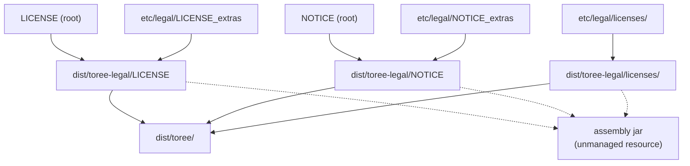

<!--
    Licensed to the Apache Software Foundation (ASF) under one
    or more contributor license agreements.  See the NOTICE file
    distributed with this work for additional information
    regarding copyright ownership.  The ASF licenses this file
    to you under the Apache License, Version 2.0 (the
    "License"); you may not use this file except in compliance
    with the License.  You may obtain a copy of the License at

      http://www.apache.org/licenses/LICENSE-2.0

    Unless required by applicable law or agreed to in writing,
    software distributed under the License is distributed on an
    "AS IS" BASIS, WITHOUT WARRANTIES OR CONDITIONS OF ANY
    KIND, either express or implied.  See the License for the
    specific language governing permissions and limitations
    under the License.
-->

# Legal files for the binary distribution

The root `LICENSE` and `NOTICE` cover Toree's own source. The binary
distribution additionally bundles third-party code inside the assembly jar,
and ASF policy requires that code to be accounted for in the `LICENSE` and
`NOTICE` that ship alongside it. That accounting lives here.

## Layout

| Path             | Contents                                                                     |
| ---------------- | ---------------------------------------------------------------------------- |
| `LICENSE_extras` | One line per bundled artifact, grouped by license, pointing at its license text |
| `NOTICE_extras`  | An index of bundled artifacts that ship a `NOTICE`, then those notices verbatim |
| `licenses/`      | Full license texts for dependencies whose license is not Apache-2.0            |

`licenses/` exists because a link is not sufficient for the non-Apache
licenses: BSD and MIT require the copyright notice and disclaimer to travel
with the binary, and jeromq's MPL-2.0 is an ASF Category B license, which
requires the license text to be included. Every file in `licenses/` must be
referenced from a `LICENSE_extras` entry (`... and licenses/LICENSE-foo.txt`);
an unreferenced file means either a stale entry or a missing reference.

## How these files reach the distribution



The `*_extras` files are concatenated onto the root `LICENSE` and `NOTICE` by
`Makefile` (targets `dist/toree-legal/LICENSE` and `dist/toree-legal/NOTICE`),
and `licenses/` is copied alongside them. `build.sbt` also adds
`dist/toree-legal` as an unmanaged resource directory, so whatever is in that
directory at assembly time is embedded in the jar as well.

The dotted edges matter: because `dist/toree-legal` is generated, a bare
`sbt assembly` on a clean tree embeds *nothing*. Only `make build` (or any
target depending on `dist/toree-legal`) produces a jar with the legal files
inside. Do not read an assembly jar built by `sbt` alone and conclude the
legal files are missing.

## Why these files drift

These files have needed correcting six times between October 2025 and March
2026, each time finding entries that were stale, missing, or wrong. That is a
structural problem rather than carelessness, and understanding the cause is
what makes the audit below tractable.

Most of what ships is never named in the build. Of the artifacts in the
assembly jar, roughly three quarters arrive transitively — nobody adds
`shapeless`, `jansi`, `spring-jcl` or the five `asm` jars to
`libraryDependencies`; they come in behind `coursier`, `classutil` and
`play-json`. A dependency bump therefore changes the bundled set in ways the
diff does not show.

The history bears this out: of the commits that changed
`project/Dependencies.scala`, only about one in six also updated
`etc/legal/`. Each of the others was a silent opportunity for these files to
fall out of date, and the periodic "fix the licenses" commits are that cost
being paid down in batches.

Two consequences for anyone touching dependencies:

- Changing a version in `Dependencies.scala` is not sufficient. Re-run the
  audit, because the transitive set may have shifted underneath it.
- Do not treat a passing build as evidence that the legal files are correct.
  Nothing in CI checks them today.

## Auditing before a release

The goal is that `LICENSE_extras` lists exactly what the assembly jar
bundles — no more, no less. Two failure directions matter equally: an entry
for something not shipped is a false claim, and a shipped artifact with no
entry is a policy violation.

Start from the built jar, not the build definition:

```bash
make build
unzip -l target/scala-2.12/toree-assembly-*.jar
```

Cross-check against the resolved classpath:

```bash
sbt "show assembly/fullClasspath"
```

Then reconcile the two lists against `LICENSE_extras`. The traps below are
the reason those two commands disagree, and why neither alone is enough.

### The classpath is not the jar

`build.sbt` sets `assembly / assemblyOption ~= { _.withIncludeScala(false) }`,
which drops the Scala distribution jars at *packaging* time. They therefore
appear on `assembly/fullClasspath` but are not in the jar, and must not be
listed. Toree gets Scala from Spark at runtime.

The exclusion is a fixed list of artifact names, not a groupId prefix, so it
is easy to under-estimate. Read out of `sbtassembly/Assembly$.class` in the
plugin jar, it covers all eight of:

```
scala-actors    scala-compiler   scala-continuations   scala-library
scala-reflect   scala-swing      scala-parser-combinators   scala-xml
```

`scala-xml` is the one that catches people. Unlike the rest it is a genuine
third-party transitive dependency — `coursier-core` declares it at compile
scope — so it resolves onto the classpath, looks entirely legitimate against
the dependency graph, and was listed here until March 2026 despite never
shipping. Check the jar, not the graph:

```bash
unzip -l target/scala-2.12/toree-assembly-*.jar | grep -c 'scala/xml'
```

Note that `scala-collection-compat` and `scala-java8-compat` publish classes
under `scala/collection/compat` and `scala/concurrent/java8`. Those *are*
bundled and *are* separate artifacts with their own entries — finding classes
under `scala/` in the jar does not mean the Scala distribution leaked in.

### The jar is not the classpath either

Some dependencies are shaded into another artifact and never appear as a jar
of their own. They are absent from every classpath while their classes ship
in the assembly, so a dependency list will never reveal them — the only
reliable trace is the metadata the containing jar carries about what it
absorbed.

There are two ways this happens, and they need two different searches. Running
only the first will miss most of it.

**Absorbed with its metadata intact.** Sweep every bundled jar for Maven
coordinates naming an artifact other than itself:

```bash
for j in $(sbt -batch "show assembly/fullClasspath" \
             | grep -o '/[^ ,]*\.jar' | sort -u); do
  unzip -l "$j" | grep -o 'META-INF/maven/[^/]*/[^/]*/pom.properties' \
    | sed "s|^|$(basename $j)  |"
done
```

Any line whose trailing coordinate does not match the jar's own name is an
absorbed dependency needing its own entry.

**Relocated, with nothing left.** Shading rewrites the package and discards the
metadata, so the search above finds nothing at all. The package path is the
only remaining trace:

```bash
unzip -l target/scala-2.12/toree-assembly-*.jar \
  | grep -oE '[a-z0-9/]*shaded?[a-z0-9/]*/' | sort -u
```

This is the search that matters most, because relocated code is invisible
everywhere else at once — not in the dependency tree, not on the classpath, not
in any metadata listing — while it ships and its licence still binds. It is
also the one that was missed: four of the six entries below were added only in
March 2026, after the first scan looked for metadata alone and found two.

Map each hit back to a project. A relocation prefix is normally the shading
project's own package plus `shaded`, so what follows is the original package:
`coursier/core/shaded/fastparse` is `com.lihaoyi:fastparse`. The package is not
always named after the artifact — `dev.dirs:directories` ships as
`coursier/cache/shaded/dirs/dev/dirs` — so match on the group as well.

Six artifacts reach the distribution this way today:

- **`org.fusesource.hawtjni:hawtjni-runtime:1.17`**, inside `jansi` 1.18.
  Its classes ship at `org/fusesource/hawtjni/runtime/`, and the version comes
  from `META-INF/maven/org.fusesource.hawtjni/hawtjni-runtime/pom.properties`
  in the jansi jar, not from any build file. Its `license.txt` contains the
  Apache-2.0 text and the EPL-1.0 text one after the other, hence the
  `(Apache-2.0 OR EPL-1.0)` annotation on the entry. EPL-1.0 alone would be
  ASF Category B, but because the grant is a disjunction Toree takes it under
  Apache-2.0, which is why the entry sits in the Apache section with no
  bundled license copy.

- **`org.jsoup:jsoup:1.13.1`**, inside `coursier-util` 2.0.0, relocated to
  `coursier/util/shaded/org/jsoup/`. jsoup is MIT, so the notice has to travel
  with the binary; `licenses/LICENSE-jsoup.txt` is that text, taken from the
  `META-INF/LICENSE` that coursier ships inside its own jar for exactly this
  reason. This one went unlisted until March 2026.

- **`dev.dirs:directories`**, inside `coursier-cache` 2.0.0, relocated to
  `coursier/cache/shaded/dirs/dev/dirs/`. It is **MPL-2.0, ASF Category B**,
  so the licence text must be bundled rather than linked — it shares
  `licenses/LICENSE-MPL-2.0.txt` with jeromq, the two texts being identical.
  Its version cannot be pinned: `coursier-cache`'s published pom omits the
  dependency entirely, which is normal for a shaded one, so the entry records
  the container version instead of guessing.

- **`com.lihaoyi:fastparse_2.12:2.3.0`**, **`geny_2.12:0.6.0`** and
  **`sourcecode_2.12:0.2.1`**, inside `coursier-core` 2.0.0 under
  `coursier/core/shaded/`. All MIT. Versions come from coursier's own
  `project/Deps.scala` at tag `v2.0.0`, and from `fastparse`'s pom for the two
  it pulls in.

The last four were found only when the search for relocated packages was added.
The metadata sweep alone reports them as absent, which is why both searches
belong in the procedure.

Pay particular attention to dependencies that vendor native code or bundle
their own dependencies — those are the ones that shade.

### `Dependencies.scala` is not the build

An entry in `project/Dependencies.scala` that no project adds to
`libraryDependencies` never reaches the classpath or the jar. Declaring a
dependency is not using it. Always audit against the artifacts, never against
the dependency list.

### An import does not mean Toree ships it

Spark is a `provided` dependency, so everything Spark brings with it is on the
*compile* classpath but excluded from the assembly. Toree code can therefore
import, compile and run against a library it does not distribute, and must not
list.

Apache Ivy is the case to know. `IvyDependencyDownloader.scala` imports
`org.apache.ivy.*` throughout, which makes it look like a bundled dependency,
and `Dependencies.scala` even declares a version for it — but nothing adds
that declaration to `libraryDependencies`. The classes come transitively from
`spark-core`, and Spark supplies them again at runtime. Ivy is not in the
assembly jar and does not belong in `LICENSE_extras`.

Reading imports, or `Compile / dependencyClasspath`, will mislead you here.
Only `assembly / fullClasspath` and the jar itself reflect what ships.

### The declared version is not the resolved version

Even for dependencies that are used, the version in `Dependencies.scala` is a
request, not an outcome. Coursier resolves conflicts by eviction, so a
transitive constraint can raise a version without any change to the build
definition.

This is live today: `Dependencies.scala` asks for `slf4j-api` 2.0.6, but
`pekko-slf4j` 1.1.5 requires 2.0.16, so 2.0.16 is what ships. `LICENSE_extras`
must record 2.0.16. Take every version from the resolved artifact:

```bash
sbt "show assembly/fullClasspath"    # jar filenames carry the real versions
```

A version that looks wrong against `Dependencies.scala` may well be right.
Check for an eviction before "correcting" it.

### Links must be pinned to tags

A link to `master`/`main` describes whatever upstream looks like today, not
what is bundled. This has produced real errors: a Jackson link that resolved
to the 3.x license while 2.14.2 was bundled, and scala module notices copied
from a later branch that misstated the copyright years and attributed the
work to the wrong organization.

Pin every link to the tag matching the bundled version. Tag naming is not
guessable and varies per project — `v14.0.1`, `rel/2.5.1`, `ASM_7_1`,
`jackson-core-2.14.2`, `release-4.9.3`, `2.9.4`. Look the tag up rather than
constructing it, and confirm the file exists at that tag; `guava` v14.0.1,
for instance, has `COPYING` and no `LICENSE`.

Two links are deliberately left on `master` because upstream offers no usable
tag. Do not "fix" them without checking:

- `bmc/classutil` — no `release-1.5.1` tag exists; upstream tags stop at
  `release-1.5.0` although 1.5.1 was published to Maven Central.
- `jupyter/jvm-repr` — the `0.1.0` tag predates the addition of the `LICENSE`
  file, so a pinned link would 404.
- `com-lihaoyi/fastparse` — the `2.3.0` tag carries no `LICENSE` at the root;
  the file exists only on the default branch.
- `dirs-dev/directories-jvm` — the shaded version cannot be determined, so
  there is no tag to pin to.

### NOTICE content is reproduced, not referenced

A `NOTICE` must carry the required notices themselves; a link is not
sufficient. The index at the top of `NOTICE_extras` records provenance, but
every bundled artifact that ships a `META-INF/NOTICE` must also have its text
reproduced verbatim below.

To find which artifacts require this, inspect each bundled jar for
`META-INF/NOTICE*`. Copy the bytes from the jar rather than retyping them,
and prefer the jar's copy over the upstream repository's when they differ —
the jar is what ships.

Copying by hand has corrupted these files before: `licenses/LICENSE-clapper.txt`
still contains a line wrap that split "You" across two lines, introduced when
the text was replaced by hand after classutil relicensed from BSD-3 to
Apache-2.0. Extract with `unzip -p` or `curl`, and diff the result against
what you commit.

Identical and overlapping notices are deduplicated rather than repeated: the
three Jackson artifacts ship byte-identical text and share one block, and
`pekko-actor`'s notice is a superset of `pekko-slf4j`'s, so the longer one
covers both.

Some artifacts ship no `NOTICE` in the jar but publish one at their upstream
tag; those are reproduced from the tag. Others have no notice anywhere and
correctly have no block at all.

## Deliberately not listed

These look like they belong in `LICENSE_extras` and do not. Each has been
added in error at least once. Confirm against the built jar before adding any
of them back.

**Apache Ivy.** `IvyDependencyDownloader.scala` imports `org.apache.ivy`
throughout, so Toree plainly uses it — but the classes arrive transitively
from `spark-core`, which is `provided`. Ivy is on the compile classpath,
absent from the assembly jar, and supplied by Spark at runtime. It was listed
in both `LICENSE_extras` and `NOTICE_extras` from February 2026 until this
was corrected. `project/Dependencies.scala` carries a note in place of the
declaration it used to hold.

**scala-library and scala-reflect.** Excluded from the assembly by
`withIncludeScala(false)`; Spark provides Scala at runtime. `scala-reflect`
was listed, together with a `licenses/LICENSE-scala.txt`, until March 2026.
Both are on `assembly / fullClasspath`, which is what makes this one easy to
get wrong.

**Anything else Spark provides.** The same reasoning covers every `provided`
dependency: on the compile classpath, not in the jar, not ours to license.

## Known limitations

`LICENSE_extras` is written for the Scala 2.12 build, which is what `Makefile`
releases by default (`SCALA_VERSION?=2.12`). The 2.13 build resolves a
different set: every cross-versioned coordinate changes, and `macro-compat`
and `scala-java8-compat` are not bundled at all. Publishing a 2.13 binary
distribution requires reworking these files to be version-aware.

## Related tooling

`etc/tools/check-licenses` runs Apache RAT to verify that *source files* carry
ASF headers. It does not inspect bundled dependencies and does not validate
anything described in this document. The audit above is currently manual.
